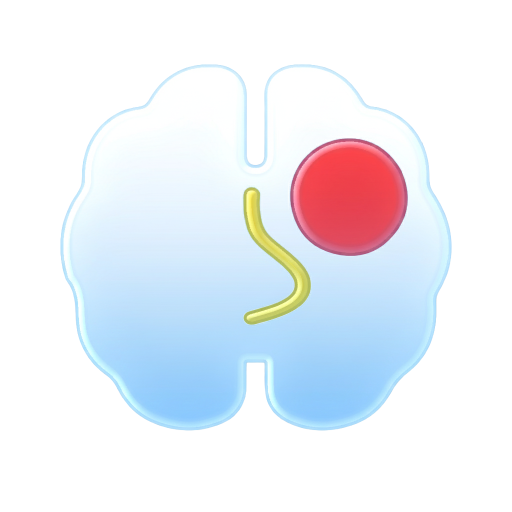

<p align="left">
  
</p>

# NeuroMetrica

NeuroMetrica is an independently developed imaging and planning workspace focused on neurosurgery, built for Apple silicon across iPad, Mac, and iPhone. Its long-term goal is to provide clinicians with powerful on-device AI tools by integrating pretrained neuroimaging models into a mobile imaging viewer. In parallel, the project aims to grow into a comprehensive Apple-native imaging workstation with the viewing, reformatting, region-of-interest (ROI), and 3D tools clinicians expect from established desktop applications.

A central design objective is to build a federated learning platform for medical imaging rather than relying exclusively on cloud-hosted models.

## Project Motivation

NeuroMetrica began after NVIDIA announced the integration of its FLARE SDK with Meta’s ExecuTorch for mobile federated learning. The accompanying examples and iOS demonstration showed a practical path for combining on-device training with server-coordinated model updates. This provided the technical starting point and confidence I needed to begin exploring the approach for medical imaging. [NVIDIA’s announcement](https://developer.nvidia.com/blog/effortless-federated-learning-on-mobile-with-nvidia-flare-and-meta-executorch/)

I am developing NeuroMetrica as an independent research and engineering project to deepen my understanding of medical imaging, explore the capabilities of modern Apple hardware, and investigate practical applications of its Neural Engine. The goal is to build on that foundation with an Apple-native imaging workspace that brings together clinical viewing tools, on-device AI, and federated learning.

## Federated Learning

NeuroMetrica is designed to operate as a federated learning client:

1. A user loads a CT or MR volume and annotates a tumor, ROI, or other segmentation target.
2. The device divides the volume into tiles and performs local training using those annotations.
3. The on-device student model updates its weights and periodically sends model weight updates, without scans or patient identifiers, to a central server running NVIDIA FLARE.
4. The server aggregates updates from participating devices into a revised global student model and distributes the updated weights through in-app model updates.

### Rationale

- **Distributed training:** Training is distributed across participating devices, with the federated server primarily responsible for aggregating updates.
- **Local data retention:** Raw imaging volumes, DICOM files, and patient identifiers remain on the device. Transmitting model weight updates instead of source imaging data is intended to reduce data-sharing risk.
- **Continuous improvement:** Labeled cases can contribute to refining the shared model, allowing work on individual cases to support improvements in future model performance.

## Planned Model Architecture

NeuroMetrica will use a group of pretrained teacher models on the server. A single on-device student model, **RedEye**, will be distilled from these teachers and subsequently updated through federated learning.

The architecture planned for the initial research paper consists of:

- Multiple task-specific teacher models on the server.
- One shared on-device student backbone.
- Separate student heads for the primary task families.
- Measurements derived from segmentation outputs wherever possible, avoiding separate measurement models when unnecessary.

### Primary Task Families

**Segmentation**

- Tumor segmentation.
- Edema segmentation.
- Anatomical and ROI segmentation where these tasks can share the same processing pipeline.

**Classification**

- Lesion presence or absence.
- Additional lightweight, study-level classification outputs where compatible with the shared student model.

**Measurement and quantification**

- Tumor volume and related quantitative measurements derived from segmentation outputs wherever possible.

This architecture is intended to make the on-device model more transparent and consistent while allowing specialized teacher models to supervise different student heads during distillation.

### Brain MRI

**[SynthSeg](https://github.com/BBillot/SynthSeg)**

Planned for brain structure segmentation across scanners, resolutions, and MRI contrasts. Its labels would supervise:

- A brain mask head distinguishing brain from non-brain tissue.
- A brain structures head for multiclass parcellation, including gray matter, white matter, cerebrospinal fluid, and subcortical regions.

**[BraTS nnU-Net](https://github.com/mobarakol/nnUNet_BraTS)**

A model pretrained on BraTS glioma data, planned for brain tumor segmentation on multisequence MRI, including enhancing tumor, tumor core, and edema. It would supervise a dedicated tumor segmentation head in RedEye.

**[VoxelMorph](https://github.com/voxelmorph/voxelmorph)**

Planned for learned deformable registration between brain volumes, such as patient-to-atlas or preoperative-to-postoperative registration. It would supervise a registration head that predicts deformation fields.

### Spine Imaging

**[Spinal Cord Toolbox models: deepseg_sc / deepseg_gm](https://github.com/sct-pipeline/deepseg-training)**

Pretrained models planned for spinal cord and, optionally, gray matter segmentation on spine MRI. They would supervise a spinal cord segmentation head for cervical and thoracic MRI.

**[TotalSegmentator](https://github.com/wasserth/TotalSegmentator)**

An nnU-Net-based CT segmentation model that includes vertebrae, ribs, and other bony structures. It would supervise:

- A vertebral segmentation head with individual vertebra labels on CT.
- Optional additional spine and CT segmentation heads, such as spinal canal or rib segmentation, as needed.

### Long-Term Deployment Plan

**Server:** Run the larger teacher models on NVIDIA GPUs to train and refine RedEye through Brightmind.

**Device:** Run the compressed RedEye model on iPad and Mac using ExecuTorch and Core ML, with ongoing federated learning. An optional cloud teacher mode would provide access to the larger server-side models.

## Backend Implementation Strategy

The project documentation uses the following labels to identify planned implementation paths:

- `[ITK]`: Use ITK or the reference backend for the current implementation.
- `[Native]`: Use an Apple-native backend.
- `[ITK -> Native]`: Implement the ITK or reference path first, then develop a native implementation if justified by performance, user experience, or product requirements.

The detailed feature roadmap, including these implementation labels, is maintained in `VERTICAL_SLICES.md`.

## Development Journal

### Update 1: UI Design Workflow

I have established a UI development workflow that begins with researching existing designs and imaging software, followed by sketching interfaces on my iPad. I then create initial mockups in Figma before refining the interface in SwiftUI and connecting it to the application’s functionality.

UI documentation is planned, and license information will be added at the V2 stage.

### Update 2: Display Calibration

Device-specific display calibration remains a significant challenge, and my current expertise and resources in this area are limited. I plan to develop a calibration algorithm that works with colorimeters, with implementation scheduled after V2 and before V3.

At that stage, I plan to buy a cheap colorimeter from Amazon, run tests, and evaluate how closely my iPad Pro display can approximate the DICOM Grayscale Standard Display Function (GSDF).

### Update 3: Federated Learning Infrastructure

The planned workflow uses NVIDIA MONAI for initial training, with NVIDIA FLARE and Flower supporting federated learning and deployment for RedEye.

Existing server-side examples provide a useful foundation. Integrating ExecuTorch with the Core ML backend is less familiar territory for me and will require further investigation, alongside research into NVIDIA FLARE deployment on iOS.

### Update 4: End-to-End Proof of Concept

Before progressing to V3, I plan to implement a complete tumor detection feature as a proof of concept, integrating ExecuTorch, its Core ML backend, and a NVIDIA FLARE server.

### Update 5: Application Identity and Development Priorities

The iOS application logo is complete, and Icon Composer is ready for the next stage.

I am eager to begin the server and model-training work, but the application itself—particularly the frontend—needs to mature first. Although I enjoy working in Illustrator and Figma, translating sketches and mockups into a functional SwiftUI interface has been one of the more demanding aspects of the project.

To stay sane, I’m taking a systematic approach: complete the UI mockups, then implement them while developing Brightmind in parallel.

### Update 6: Interface Design Influences

I have begun researching picture archiving and communication systems (PACS) from the 1990s and early 2000s to inform the interface design. The goal is to create an application that feels contemporary while retaining familiar elements for radiologists and surgeons who have used earlier imaging systems.

Design references include Agfa IMPAX and Siemens MagicView from the 1990s, along with Fuji Synapse PACS from the early 2000s. These references inform the color palette, layout, and reinterpretation of legacy toolbar icons using modern, animated SF Symbols. The aim is to combine familiar clinical workflows with a contemporary Apple-native interface.

### Update 7: ITK Support for Apple Platforms

I initially planned to use DCMTK and a NIfTI library for DICOM and NIfTI support. I subsequently revised that approach and built ITK for Apple platforms, replacing the planned DCMTK integration.

This work required custom build scripts and source modifications for macOS, iOS, and visionOS, including device and simulator targets. I have published the work as a dedicated project: [ITK-6.0-ApplePlatforms](https://github.com/modelbashir-create/ITK-6.0-ApplePlatforms).

### Update 8: ITK Integration and Native Processing Strategy

I successfully built an `ITK.xcframework` with support for macOS, iOS, and visionOS, including device and simulator targets, and integrated it into the `ChromaImagingCore` package.

The current plan is to use ITK primarily for input/output and basic image operations. Well-optimized C++ can deliver performance comparable to or better than Swift implementations using vDSP, and ITK provides an established foundation for image processing.

For 3D rendering and AI workloads, I intend to prioritize Metal and Core ML where their capabilities are better suited to the task. Straightforward operations may be reimplemented in Swift using ITK’s logic as a reference. More complex operations will receive native implementations when Metal or Core ML offers a clear advantage.

### Metadata Diagnostics

Metadata diagnostics use `AppLogger`, with protected health information (PHI) redacted by default.
### Metadata Diagnostics

Metadata diagnostics use `AppLogger`, with protected health information (PHI) redacted by default.

Metadata diagnostics example (AppLogger, PHI redacted by default):

```
Metadata checklist: present=22, missing=2, malformed=0, inconsistent=0, n/a=0
Metadata missing: Accession Number [0008,0050] (PHI)
Metadata missing: Window Center [0028,1050]
```

Status key: `✅` done, `◐` partially implemented / in progress, `☐` not done yet.

### V1.1 – File & Format Support

- ✅ Open **DICOM** series (CT/MR brain and spine)
- ✅ Open **NIfTI** volumes (`.nii`, `.nii.gz`)
- ✅ Basic file open flow from the Mac app for NIfTI volumes (e.g., file menu / open button)
- ✅ Clear error message when a file cannot be opened or is unsupported

### V1.2 – Viewing & Navigation

- ✅ Single main viewport
- ✅ Ability to choose **orientation**: axial / coronal / sagittal (one at a time)
- ✅ **Scroll wheel / trackpad over the image** moves through slices
- ✅ **Arrow keys** move through slices
- ✅ **Slice index display** (e.g. `32 / 188`)

### V1.3 – Image Appearance (WW/WL)

- ✅ **Window** slider
- ✅ **Level** slider
- ✅ Image updates in real time when WW/WL changes
- ✅ Numeric **WW/WL readout** visible (e.g. `W: 80  L: 40`)
- ✅ Grayscale rendering appropriate to modality (no inverted CT by accident)

### V1.4 – Overlays & Metadata

- ✅ **Orientation labels** on screen (AX / COR / SAG, and later L/R markers)
- ✅ **Slice position** visible somewhere (index and/or physical position)
- ✅ Basic **study/series info** visible (modality, study/series description)
- ◐ Basic **voxel spacing** available in a small info panel or overlay

### V1.5 – Reliability & UX Basics

- ☐ Reasonable performance for typical CT/MR brain volumes on Apple silicon Macs
- ✅ Dark viewer UI that doesn’t distract from the image
- ✅ Clear, non-confusing empty state when no study is loaded
- ✅ If loading fails, the user sees an explanatory message (not just a black screen)

---

## V2 – Complete 2D Workstation (Planning-Ready)

Goal: feels like a serious 2D workstation clinicians can actually plan with, not just scroll.

### V2.1 – Pro Interaction Tools

- ✅ **Zoom** in/out on the image (trackpad gesture or scroll + modifier)
- ✅ **Pan** the image when zoomed (click–drag)
- ✅ **Fit to window** action
- ✅ **Reset view** (zoom + pan back to default)

### V2.2 – WW/WL Behavior Upgrades

- ✅ **Drag-based WW/WL** (e.g. modifier + drag over the image)
- ✅ WW/WL **sliders** and drag interaction stay in sync
- ✅ Simple **WW/WL presets** (e.g. Brain / Bone / Soft Tissue where appropriate)
- ✅ Presets show their numeric values somewhere (not “magic”)

### V2.3 – Measurements & Planning

- ☐ **Distance ruler** tool:
  - ☐ Click–drag to place a measurement line
  - ☐ Distance displayed in **millimeters**, using voxel spacing
  - ☐ Works in axial, coronal, and sagittal views
- ☐ Easy way to delete/clear measurements
- ☐ Measurements are clearly visible but not visually overwhelming

*(Angle tool and more advanced planning can be V2.x or V3.)*

### V2.4 – Export & Sharing

- ◐ **Export current view** as PNG or JPEG
  - ☐ Includes current WW/WL
  - ☐ Includes current zoom/pan
- ☐ Option to export **with overlays** (orientation, slice, measurements)
- ☐ Option to export **without overlays** (clean image)
- ☐ **Copy image to clipboard** for quick paste into slides/emails

### V2.5 – Study Info Panel

- ◐ Toggle-able **Study Info** panel with:
  - ✅ Modality
  - ✅ Study and series description
  - ✅ Patient ID/name (or anonymized display, depending on mode)
  - ✅ Study date
  - ◐ Image matrix size and voxel spacing
- ✅ Info panel layout does not interfere with reading (can be hidden quickly)

### V2.6 – Workstation Parity Layer

- ☐ **Sync Images** across linked 2D viewports / series
- ☐ Broader ROI / annotation tools:
  - ☐ Angle
  - ☐ Point
  - ☐ Area
  - ☐ Closed Path
  - ☐ Curved Line
  - ☐ Text
  - ☐ Arrow
  - ☐ Scribble
- ☐ Projection / re-slicing tools for **MIP / Mean / MinIP**
- ☐ Adjustable **thick slab** controls for non-curved 2D/MPR workflows

### V2.7 – AI Review & Correction Foundation

- ☐ Display **model output overlays** in 2D and basic MPR workflows
- ☐ Provide a basic **correction / edit workflow** for the first FL task family
- ☐ Save corrected outputs locally in a reusable format
- ☐ Log correction metadata for FL ingestion:
  - ☐ case / study identifier
  - ☐ model version
  - ☐ prediction timestamp
  - ☐ correction timestamp
  - ☐ correction type / status

---

## V3A – Advanced MPR & Projection Foundation

Goal: extend the 2D workstation into a serious advanced viewing environment with stronger MPR, projection, and slab tools before the full 3D workspace takes over.

### V3A.1 – MPR Maturation

- ◐ Mature **3D MPR view** as a first-class viewing mode, not just a transitional scaffold

### V3A.2 – Projection & Slab Modes

- ☐ Implement a GPU-capable **MIP** pipeline using `VolumeMapper` / Metal compute where native acceleration is justified
- ☐ Support MIP along AX / COR / SAG axes
- ☐ Support additional projection modes: **Mean** and **MinIP**
- ☐ Integrate WW/WL with projection rendering so presets and sliders affect advanced views as expected
- ☐ Support adjustable **thick slab** controls for projection-based views

## V3B – 3D Workspace Foundation

Goal: first true 3D-capable release. Introduce a dedicated 3D workspace with familiar navigation and a basic VR viewer implemented for Apple-silicon acceleration.

### V3B.1 – 3D Modes & Viewer

- ☐ Add a dedicated 3D viewer mode / workspace (enterable from the 2D viewer)
- ☐ Support modes: **Slice**, **MIP**, and **Basic VR** (volume rendering prototype)
- ◐ Clear UI toggle between 2D viewer and 3D viewer

### V3B.2 – 3D Navigation & Camera

- ☐ Rotate the volume in 3D (click–drag / trackpad gesture)
- ☐ Zoom/pan within the 3D viewer
- ☐ Camera presets for standard orientations (Axial / Coronal / Sagittal)
- ☐ Simple orientation widget (e.g. a cube or compass) that reflects camera orientation

### V3B.3 – Basic Volume Rendering (VR Prototype)

- ☐ Implement a first-pass VR renderer (ray casting or similar) on GPU
- ☐ Use a simple transfer function (grayscale + single opacity curve)
- ☐ Add a basic quality vs performance control (e.g. resolution / sampling slider)
- ☐ Ensure VR works interactively on modern Apple silicon Macs

### V3B.4 – Cropping & Performance

- ☐ Add a non-destructive 3D cropping box (limit the rendered region)
- ☐ Keep volume data resident on GPU for 3D modes to reduce upload overhead
- ☐ Establish baseline performance targets for typical CT/MR volumes in 3D

## V3C – Curved / Centerline MPR

Goal: build the dedicated curved/centerline workflow and exports that support a centerline-specific publication track and later visionOS expansion.

### V3C.1 – Curved / Centerline Reformatting

- ☐ Implement **Curved 3D MPR** / curved planar reformat workflow
- ☐ Support **curved path navigation**
- ☐ Support generation of transverse slices along the curved path
- ☐ Export the **curved planar view** and all associated **transverse slices**

---

## V4 – Advanced 3D Exploration & Editing

Goal: make the 3D environment clinically useful by adding sculpting, “bone removal,” richer transfer functions, 4D time navigation, and simple fusion.

### V4.1 – Sculpting & Masks

- ☐ Add 3D sculpting tools (e.g. scissors/brush) that operate on **masks**, not raw voxel data
- ☐ Add direct **brush** tools for interactive 3D masking / cleanup
- ☐ Support operations like: hide region, keep only region, undo/revert
- ☐ Implement preset-based “bone removal” using HU ranges (for CT) via masks
- ☐ Add simple **auto-removal** tools for common cleanup workflows
- ☐ Ensure sculpting is non-destructive and can be toggled on/off

### V4.2 – Transfer Functions & 3D Presets

- ☐ Add a **transfer function / CLUT editor** (color + opacity) with a histogram view
- ☐ Support saving/loading 3D rendering presets (VR/MIP settings, transfer function, shading)
- ☐ Group presets by modality / anatomy (e.g. Brain, CTA, Spine)
- ☐ Show presets as thumbnails generated from the current volume pose

### V4.3 – 4D Time & Simple Fusion

- ☐ Support 4D volumes (time dimension) in the 3D/MIP viewer
- ☐ Add a time slider and simple cine playback controls for dynamic series
- ☐ Implement basic two-volume fusion (e.g. structural + functional) with alpha blending
- ☐ Allow toggling fusion overlays on/off quickly

### V4.4 – 3D Export & Sharing

- ☐ Export short 3D rotations or time sequences as movies (e.g. MP4)
- ☐ Export still 3D snapshots at current camera pose and transfer function
- ☐ Ensure exported media respect current WW/WL, zoom, and overlay settings

---

## V5 – AI, Registration & Smart Workflows

Goal: layer intelligence on top of the mature 2D/3D viewer so Neurometrica competes with high-end workstations through AI, smart presets, and registration-driven fusion.

### V5.1 – AI Segmentation & Overlays

- ☐ Integrate Core ML–based segmentation models for key neuro use cases (e.g. tumor, vessels, structures)
- ☐ Run segmentation on-device using Apple silicon (CPU/GPU/NPU)
- ☐ Display segmentation results as overlays in 2D and 3D viewers
- ☐ Provide clear controls to toggle overlays and adjust opacity

### V5.2 – Registration & Fusion

- ☐ Implement rigid/affine volume registration between studies (same patient)
- ☐ Allow viewing registered volumes in fused 2D and 3D modes
- ☐ Save and re-use registration transforms when possible
- ☐ Provide basic tools to inspect registration quality (e.g. checkerboard, edge overlay)

### V5.3 – Specialty Measurements

- ☐ **Cobb Angle**
- ☐ **CTR**
- ☐ Additional specialty ROI / measurement templates driven by concrete clinical workflows

### V5.3 – Automation & Smart Suggestions

- ☐ AI-driven WW/WL and preset recommendations based on modality/anatomy
- ☐ Automatic key-slice / key-timepoint suggestions (e.g. “best axial tumor slice”)
- ☐ Optional smart layout suggestions (e.g. tri-planar layout when appropriate)

### V5.4 – Advanced Export & Sharing

- ☐ Export multi-view cine loops (e.g. tri-planar cine for tumor follow-up)
- ☐ Export annotated images/series with measurements and overlays baked in
- ☐ Consider modern 3D export formats (e.g. USDZ) for sharing 3D scenes outside the app
